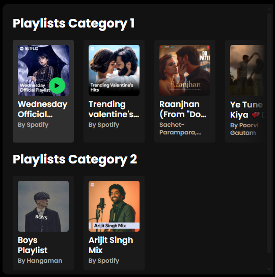
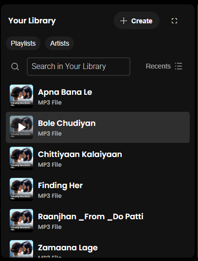
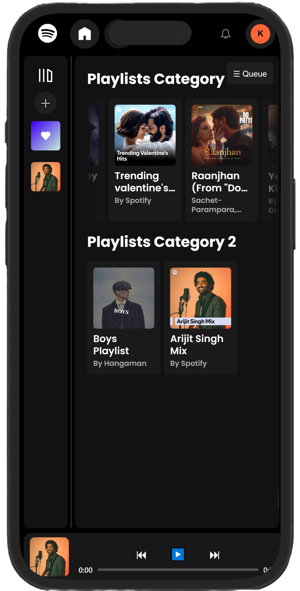

# 🎧 Spotify Clone (Frontend) – HTML | CSS | JavaScript

A **fully responsive** music web app with a custom UI inspired by Spotify 🎶  
Built using **pure HTML, CSS, and JavaScript**, this clone loads songs dynamically from local folders and extracts metadata using `jsmediatags`.

---

## 🔥 Features

- 🎨 **Custom Spotify-Inspired UI**
- 📁 **Dynamic Folder-Based Song Loading**
- 🖼️ **Album Art & Metadata Extraction**
- 💻 **Fully Responsive Design**
- 🧪 Built with **Vanilla JS (No frameworks)**

---

## 📸 Screenshots

| UI | Playlist View | Responsive Layout |
|----|---------------|-------------------|
|  |  |  |

---

## ⚙️ Tech Stack

| Tech | Usage |
|------|--------|
| HTML5 | Page structure |
| CSS3 | Custom UI styling |
| JavaScript | DOM manipulation, song loading |
| jsmediatags | Read song metadata (title, artist, album art) |

---

## 🧠 How It Works

1. Fetches all `.mp3` files from a local folder (e.g., `/songs/`)
2. Parses metadata using `jsmediatags`
3. Displays song name, artist & album art on the fly
4. Plays songs with custom controls and animation

---

## 🚀Demo


---

## 📂 Run Locally

```bash
git clone https://github.com/your-username/spotify-clone.git
cd spotify-clone
# Open index.html in your browser (use Live Server or localhost)
