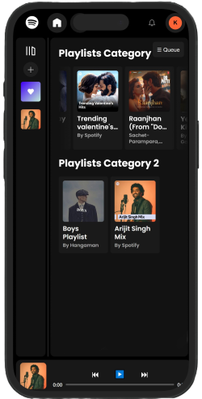
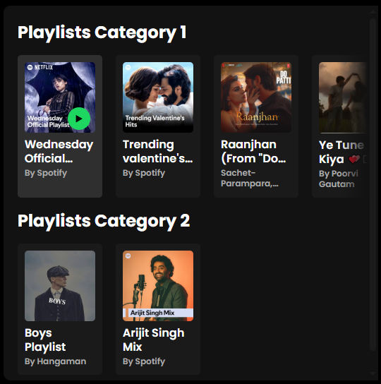

# 🎵 Spotify Clone - Web Music Player



A **fully functional, slick AF Spotify web clone** made using plain JavaScript, HTML, and CSS.  
Supports **dynamic playlists**, **live music preview**, **repeat modes**, **shuffle**, **volume control**, and more.  
💥 No frameworks. No BS. Just pure DOM domination 🧠💻

---

## 🚀 Features

| Feature                            | Status |
| ---------------------------------- | ------ |
| 🔥 Dynamic playlist & song loading | ✅     |
| 🎧 Play/Pause per card and song    | ✅     |
| 🔁 Repeat Modes (None, All, One)   | ✅     |
| 🔀 Shuffle Mode                    | ✅     |
| 🔊 Volume slider with mute toggle  | ✅     |
| 🎚️ Audio feedback with synced UI   | ✅     |
| 🎨 Slick CSS transitions & visuals | ✅     |
| 📦 Organized file/folder structure | ✅     |
| 🧠 Fully JS-powered Audio API      | ✅     |

---

## 📸 Screenshots

> _Spoiler: Looks sexier live._




---

## 🧠 Tech Stack

- 🟩 **Vanilla JavaScript**
- 🟨 **HTML5**
- 🎨 **CSS3**
- 🎧 **HTML Audio API**
- 📁 Dynamic `fetch()` + `info.json` loaders

---

## 🛠 How It Works

- 📂 Music folders inside `/libraries/` are auto-scanned
- 🎶 Playlists and songs are fetched dynamically
- ⏯️ Every card and list item is playable
- 🔁 Repeat & 🔀 shuffle modes handled via custom logic
- 🔊 Volume control has dynamic slider + mute handling
- UI updates stay in sync with playback status, current song, and player bar

---

## 🧪 Try It Live

> 🔗 Coming soon: Deploying to Netlify/GitHub Pages  
> Until then, clone it locally:

```bash
git clone https://github.com/Khushvant-Mahale/Spotify-Clone.git
cd Spotify-Clone
npx live-server
# or use VS Code Live Server extension
```
