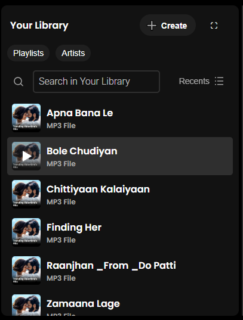
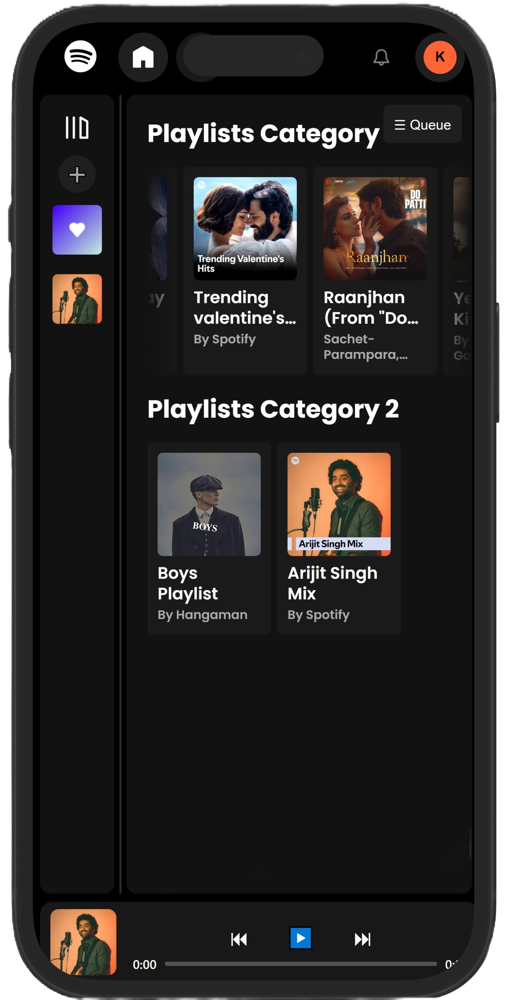

# 🎧 Spotify Clone – HTML | CSS | JavaScript

A **fully responsive, full-featured Spotify-inspired music player** 🔥  
Built from scratch using **pure HTML, CSS & JavaScript** — no frameworks, no BS, just skill 💪  
Loads songs dynamically from folders, extracts metadata, and plays like a real app 🎶

---

## 🔥 Features

- 🎨 **Custom Spotify-Style UI**
- 📁 **Dynamic Playlist Loading from Folder Structure**
- 🧠 **Metadata Extraction** (Album, Artist, Title via `jsmediatags`)
- 🎧 **Audio Controls** (Play, Pause, Next, Previous)
- 🔁 **Repeat Modes**: No Repeat / Repeat All / Repeat One
- 🔀 **Shuffle Mode** (Random song playback)
- 🔊 **Volume Control** with smooth gradient slider
- 🖼️ **Album Art Auto Load**
- 🧠 **Smart Play Logic** (No reloading same song, toggle handling)
- 📱 **Fully Responsive Design**
- ⚡ **Zero Frameworks** (Vanilla JavaScript mastery)

---

## 📸 Screenshots

| 🎵 Home UI                    | 📂 Playlist View                      | 📱 Mobile Responsive              |
| ----------------------------- | ------------------------------------- | --------------------------------- |
|  |  |  |

---

## ⚙️ Tech Stack

| Tech                     | Purpose                   |
| ------------------------ | ------------------------- |
| **HTML5**                | App structure & layout    |
| **CSS3**                 | Custom UI + animations    |
| **JavaScript (Vanilla)** | Logic, audio, DOM control |
| **jsmediatags**          | Extract MP3 metadata      |

---

## 🧠 How It Works

1. Scans folders inside `/libraries/` to dynamically build playlists
2. Parses each folder’s `info.json` for title, description & thumbnail
3. Fetches `.mp3` files and reads their metadata using `jsmediatags`
4. Displays songs in custom UI and plays them using HTML5 Audio
5. Supports:
   - 🔁 Repeat One / All / None
   - 🔀 Shuffle mode
   - 🔊 Volume slider + mute
   - 🧠 Smart play state handling

---

## 🕹️ Controls

| Control | Behavior                        |
| ------- | ------------------------------- |
| ▶️ / ⏸️ | Play/Pause                      |
| ⏮️ / ⏭️ | Prev / Next Song                |
| 🔁      | Repeat Modes (None → All → One) |
| 🔀      | Shuffle Mode Toggle             |
| 🔊      | Volume & Mute                   |
| 📁      | Dynamic Playlist Loader         |

---

## 🚀 Demo Preview

📽️ _[Preview Video](screenshots/preview.mkv)_  
(_host it on GitHub or convert to GIF for live demo in future_)

---

## 🧪 Try It Locally

```bash
git clone https://github.com/Khushvant-Mahale/Spotify-Clone.git
cd Spotify-Clone
# Open index.html using Live Server or localhost
```
